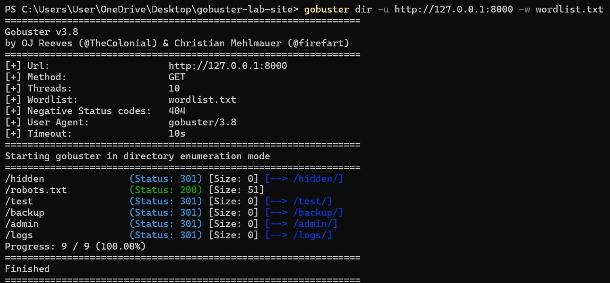
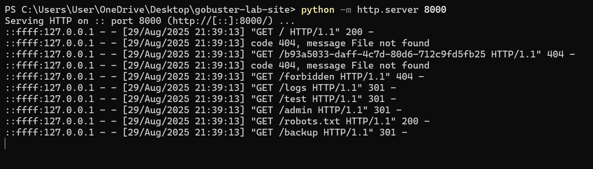

# 🔍 Gobuster Lab – Hands-On Web Directory Enumeration

## 📌 What This Repo Includes

This repository contains a small vulnerable lab environment designed to help you practice directory brute-forcing with Gobuster.  
It simulates a real-world scenario where a website has both visible and hidden directories.

By following this guide, you will:

- Run a local web server with hidden files and directories.
- Use Gobuster to enumerate and discover those directories.
- Analyze the results like a penetration tester.
- Learn key security takeaways for both attackers and defenders.

---

## 🛠️ Prerequisites

Make sure you have the following installed on your machine:

- Python 3  
- Gobuster  
- Git  
- A terminal (PowerShell, CMD, or Bash)

---

## 📂 Getting Started

### 1️⃣ Clone the Repository
```bash
git clone https://github.com/Dev-Ahmed-Hassan/gobuster-lab.git
cd gobuster-lab
```

### 2️⃣ Run the Local Server

You can start the local server in two ways:

**Option 1: Simple Python server (quick setup)**
```bash
python -m http.server 8000
```

**Option 2: Flask (more control over routes & responses)**
```bash
python app.py
```

Your server will now be running locally on:  
👉 http://127.0.0.1:8000

---

## 🚀 Running Gobuster

Open a new terminal in the same project folder and run:

```bash
gobuster dir -u http://127.0.0.1:8000 -w wordlist.txt -q
```

### Flags Explained
- `dir` → Directory brute-forcing mode  
- `-u` → Target URL (your local server)  
- `-w` → Path to wordlist file  
- `-q` → Quiet mode (cleaner output)

---

## 📊 Expected Results

If everything works, Gobuster should discover hidden files/directories such as:

```
/logs       (Status: 301)
/admin      (Status: 301)
/robots.txt (Status: 200)
/test       (Status: 301)
/hidden     (Status: 301)
/backup     (Status: 301)
```

---

## 🔐 Security Takeaways

- Developers often leave behind backup files, test directories, or admin panels exposed.  
- Attackers use tools like Gobuster to discover these hidden paths.  
- Defenders can reduce risk by:  
  - Removing sensitive files from production servers.  
  - Securing admin panels with authentication.  
  - Setting correct permissions and access controls.  
  - Monitoring logs for suspicious enumeration activity.  

---

## 📸 Screenshots

  
This screenshot shows **Gobuster successfully discovering hidden directories** such as `/hidden`, `/admin`, `/logs`, `/backup`, and the `robots.txt` file.  
The output highlights the status codes for each discovered path, simulating how an attacker would map out hidden content.
_______
  
This screenshot shows the server logs for the requests made by gobuster

---

## 📌 Next Steps (Optional)

- Try subdomain enumeration with Gobuster.  
- Use Wireshark to capture and analyze requests made by Gobuster.  
- Explore defensive configurations to protect against brute-forcing.  

---
